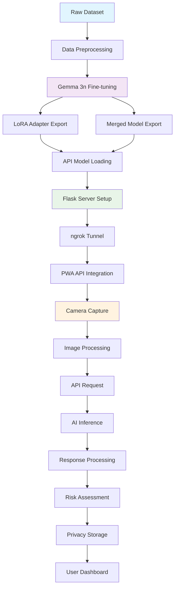

# 🔄 Keylike ML Integration Overview

## Complete Machine Learning Pipeline Integration Guide

This comprehensive guide provides the complete picture of how the Keylike AI project integrates machine learning components from training to production deployment. It connects the training pipeline ([`TRAINING_NOTEBOOK_GUIDE.md`](TRAINING_NOTEBOOK_GUIDE.md)) with API deployment ([`API_NOTEBOOK_GUIDE.md`](API_NOTEBOOK_GUIDE.md)) and PWA integration to create a seamless end-to-end ML workflow.

---

## 📋 Table of Contents

1. [System Architecture Overview](#system-architecture-overview)
2. [Complete Workflow Pipeline](#complete-workflow-pipeline)
3. [File Formats & Data Flow](#file-formats--data-flow)
4. [Integration Points & Handoffs](#integration-points--handoffs)
5. [PWA Integration Context](#pwa-integration-context)
6. [Development Workflow](#development-workflow)
7. [Troubleshooting Integration Issues](#troubleshooting-integration-issues)
8. [Performance Considerations](#performance-considerations)
9. [Security & Privacy Implementation](#security--privacy-implementation)
10. [Production Deployment Strategy](#production-deployment-strategy)
11. [Monitoring & Maintenance](#monitoring--maintenance)
12. [Reference Architecture](#reference-architecture)

---

## 🏗️ System Architecture Overview

### High-Level Architecture

The Keylike AI system consists of three main components that work together to provide privacy-first lock vulnerability detection:

```
┌─────────────────────────────────────────────────────────────────┐
│                    KEYLIKE AI ARCHITECTURE                     │
├─────────────────────────────────────────────────────────────────┤
│                                                                 │
│  ┌─────────────────┐    ┌─────────────────┐    ┌──────────────┐ │
│  │   TRAINING      │    │   API SERVER    │    │     PWA      │ │
│  │   PIPELINE      │    │   DEPLOYMENT    │    │  FRONTEND    │ │
│  │                 │    │                 │    │              │ │
│  │ • Data Prep     │───▶│ • Model Loading │───▶│ • Camera UI  │ │
│  │ • Gemma 3n      │    │ • Flask/FastAPI │    │ • Privacy    │ │
│  │ • LoRA Training │    │ • ngrok Tunnel  │    │ • Encryption │ │
│  │ • Model Export  │    │ • Inference API │    │ • Results    │ │
│  └─────────────────┘    └─────────────────┘    └──────────────┘ │
│                                                                 │
└─────────────────────────────────────────────────────────────────┘
```

### Component Responsibilities

| Component | Primary Responsibilities | Technologies |
|-----------|-------------------------|--------------|
| **Training Pipeline** | Dataset preparation, Gemma 3n fine-tuning, model optimization | Unsloth, PyTorch, Hugging Face Transformers |
| **API Server** | Model hosting, inference processing, response formatting | Flask, ngrok, Python, PIL |
| **PWA Frontend** | User interface, camera integration, privacy-first storage | Lit.dev, TypeScript, Capacitor, Web Crypto API |

---

## 🔄 Complete Workflow Pipeline

### Training → API → PWA Flow



### Step-by-Step Process Flow

#### Phase 1: Training ([`TRAINING_NOTEBOOK_GUIDE.md`](TRAINING_NOTEBOOK_GUIDE.md))

1. **Dataset Preparation**
   - Image processing (resize to 336x336)
   - JSONL format conversion
   - Train/validation split

2. **Model Training**
   - Gemma 3n-E4B base model loading
   - LoRA configuration (r=32, alpha=32)
   - Supervised fine-tuning with vision data

3. **Model Export**
   - LoRA adapter saving (~100MB)
   - Merged model creation (~8GB)
   - TensorFlow.js conversion (optional)

#### Phase 2: API Deployment ([`API_NOTEBOOK_GUIDE.md`](API_NOTEBOOK_GUIDE.md))

1. **Environment Setup**
   - Python virtual environment
   - Dependency installation (Unsloth, Flask, etc.)
   - GPU optimization

2. **Model Loading**
   - LoRA adapter loading with base model
   - Memory optimization (4-bit quantization)
   - Inference mode activation

3. **API Server**
   - Flask application setup
   - Image processing endpoints
   - Response formatting

4. **Public Access**
   - ngrok tunnel establishment
   - CORS configuration
   - Security headers

#### Phase 3: PWA Integration ([`src/services/model-service.ts`](../src/services/model-service.ts))

1. **Camera Integration**
   - ImageData capture via Capacitor
   - Image quality validation
   - Format conversion to JPEG blob

2. **API Communication**
   - FormData preparation
   - HTTP request with timeout
   - Response parsing and validation

3. **Results Processing**
   - Dynamic field extraction
   - Risk assessment calculation
   - Privacy-first storage

---

## 📄 File Formats & Data Flow

### Data Transformation Journey

```
Raw Images (JPG/PNG)
    ↓ [Training Pipeline]
ImageData (336x336 RGB)
    ↓ [Conversation Format]
JSONL Training Data
    ↓ [Fine-tuning]
LoRA Adapter (.bin/.json)
    ↓ [API Loading]
Loaded Model (Memory)
    ↓ [Inference]
API Response (JSON)
    ↓ [PWA Processing]
ModelPrediction (TypeScript)
    ↓ [Storage]
Encrypted Data (IndexedDB)
```

### File Format Specifications

#### Training Data Format
```json
{
  "image_path": "images/key_001.jpg",
  "bittings": [1, 2, 5, 3, 7],
  "keyway": "SC1",
  "brand": "Schlage"
}
```

#### API Response Format
```json
{
  "success": true,
  "request_id": "a1b2c3d4",
  "keyway": "SC1",
  "bitting": "2,5,4,7,3",
  "brand": "Schlage",
  "confidence": 0.87,
  "estimatedAnnualProduction": 47250000,
  "manufacturingComplexity": 35,
  "marketPenetration": 0.423,
  "timeInMarket": 0.945,
  "timestamp": 1692825600000,
  "api_version": "2.0.0"
}
```

#### PWA Internal Format ([`src/types/scan-types.ts`](../src/types/scan-types.ts))
```typescript
interface ModelPrediction {
  keyway: string;
  confidence: number;
  lockType: string;
  brandDetected: string;
  bittingPattern: number[];
  estimatedAnnualProduction: number;
  manufacturingComplexity: number;
  marketPenetration: number;
  timeInMarket: number;
  // ... additional fields
}
```

### Model File Organization

```
models/
├── training/
│   ├── gemma3n_keynet_vision_lora_enhanced/     # LoRA Adapter (~100MB)
│   │   ├── adapter_model.bin
│   │   ├── adapter_config.json
│   │   └── tokenizer.json
│   └── gemma3n_keynet_vision_merged_enhanced/   # Merged Model (~8GB)
│       ├── model.safetensors
│       ├── config.json
│       └── tokenizer.json
├── api/
│   └── loaded_model/                           # Runtime model
└── pwa/
    └── tfjs_model/                            # TensorFlow.js (optional)
        ├── model.json
        └── weights.bin
```

---

## 🔗 Integration Points & Handoffs

### Critical Integration Checkpoints

#### Checkpoint 1: Training → API
- **File Transfer**: LoRA adapter or merged model files
- **Validation**: Model loading verification
- **Testing**: Sample inference with known images

```python
# Validation code from API_NOTEBOOK_GUIDE.md
model, tokenizer = FastVisionModel.from_pretrained(
    model_name="unsloth/gemma-3n-E4B-it",
    adapter_name="./models/gemma3n_keynet_vision_lora_enhanced",
    max_seq_length=2048,
    dtype=torch.bfloat16,
    trust_remote_code=True,
)
```

#### Checkpoint 2: API → PWA
- **URL Configuration**: ngrok tunnel endpoint
- **Response Format**: JSON schema validation
- **Error Handling**: Timeout and failure scenarios

```typescript
// PWA configuration from model-service.ts
private readonly apiUrl: string = 'https://cc39c3629df7.ngrok-free.app/';
private readonly requestTimeout: number = 120000; // 2 minutes
```

#### Checkpoint 3: PWA → Storage
- **Data Privacy**: Encryption before storage
- **Format Conversion**: API response to internal types
- **Validation**: Required field verification

### Data Handoff Validation

```python
# API Response Validation
def validate_api_response(response: dict) -> tuple[bool, list]:
    required_fields = ['success', 'keyway', 'bitting', 'brand', 'confidence']
    missing_fields = []
    
    for field in required_fields:
        if field not in response or response[field] is None:
            missing_fields.append(field)
    
    return len(missing_fields) == 0, missing_fields
```

---

## 📱 PWA Integration Context

### Model Service Architecture

The PWA integration is centered around the [`ModelService`](../src/services/model-service.ts) class that handles all ML-related operations:

```typescript
export class ModelService {
  private readonly apiUrl: string;
  private readonly requestTimeout: number = 120000;
  
  async predict(imageData: ImageData, zipcode: string): Promise<ModelPrediction>
  async validateImageQuality(imageData: ImageData): Promise<ImageQualityMetrics>
  getDiagnostics(): ModelDiagnostics
  // ... additional methods
}
```

### Camera Integration Flow

```
User Interaction
    ↓
Camera Capture (Capacitor)
    ↓
ImageData Processing (Canvas API)
    ↓
Quality Validation (Local Analysis)
    ↓
JPEG Blob Conversion
    ↓
FormData Preparation
    ↓
API Request (Fetch with Timeout)
    ↓
Response Processing
    ↓
Privacy-First Storage (Encrypted)
```

### Privacy Implementation

The PWA implements several privacy-first features:

1. **Local Processing**: Image quality validation happens on-device
2. **Encrypted Storage**: All scan results encrypted with Web Crypto API
3. **Location Anonymization**: GPS coordinates converted to geohash
4. **No User Accounts**: Anonymous usage with local data only

```typescript
// Privacy implementation from privacy-service.ts
await encryptionService.encryptData(scanResult, userKey);
const geohash = await geoHashLocation(coordinates, precision);
```

### Expected Response Integration

The PWA expects specific response fields from the API:

| Field | Type | Required | Description |
|-------|------|----------|-------------|
| `success` | boolean | ✅ | Request success status |
| `keyway` | string | ✅ | Detected keyway type (SC1, KW1, etc.) |
| `bitting` | string | ✅ | Comma-separated bitting pattern |
| `brand` | string | ✅ | Lock manufacturer |
| `confidence` | number | ✅ | Model confidence (0.0-1.0) |
| `estimatedAnnualProduction` | number | ✅ | Dynamic production estimate |
| `manufacturingComplexity` | number | ✅ | Complexity score |
| `marketPenetration` | number | ⚠️ | Market presence ratio |
| `timeInMarket` | number | ⚠️ | Time-based factor |

---

## 🛠️ Development Workflow

### Typical Development Cycle

#### 1. **Experimentation Phase**
```bash
# Training environment setup
pip install --upgrade unsloth unsloth_zoo
jupyter notebook Training_Keylike_notebook.ipynb

# Experiment with:
# - Dataset variations
# - Hyperparameter tuning
# - Model architectures
```

#### 2. **Model Training & Validation**
```python
# Training execution
trainer = SFTTrainer(model=model, train_dataset=train_dataset, ...)
trainer_stats = trainer.train()

# Model saving
model.save_pretrained("gemma3n_keynet_vision_lora_enhanced")
tokenizer.save_pretrained("gemma3n_keynet_vision_lora_enhanced")
```

#### 3. **API Integration Testing**
```bash
# API server setup
python app.py

# Test with sample images
curl -X POST https://your-ngrok-url.ngrok.app/ \
  -F "image=@sample_key.jpg" \
  -F "zipcode=12345"
```

#### 4. **PWA Integration**
```bash
# Update API URL in PWA
# src/services/model-service.ts: Update apiUrl

# Development server
npm run dev

# Build and test
npm run build
npm run preview
```

#### 5. **End-to-End Testing**
```bash
# Full pipeline test
1. Train model → Save LoRA adapter
2. Load in API → Test inference
3. Update PWA → Test camera capture
4. Verify results → Check encryption
```

### Version Control Strategy

```
git/
├── main/                    # Production-ready code
├── development/             # Active development
├── training/               # ML experiments
│   ├── experiment-v1/      # Dataset v1 results
│   ├── experiment-v2/      # Hyperparameter tuning
│   └── experiment-v3/      # Architecture changes
└── integration/            # API-PWA integration testing
```

### Model Versioning

```python
# Model metadata tracking
model_metadata = {
    "version": "2.0.0-enhanced",
    "training_date": "2025-08-05",
    "dataset_size": 1000,
    "training_epochs": 2,
    "performance_metrics": {
        "accuracy": 0.87,
        "inference_time": 2.1,
        "format_compliance": 0.90
    }
}
```

---

## 🔧 Troubleshooting Integration Issues

### Common Integration Problems

#### 1. **Training → API Issues**

**Model Loading Failures**
```python
# Symptom: "Failed to load adapter"
# Diagnosis:
def diagnose_model_loading(model_path):
    if not os.path.exists(model_path):
        return "Path does not exist"
    
    required_files = ['adapter_model.bin', 'adapter_config.json']
    missing = [f for f in required_files if not os.path.exists(os.path.join(model_path, f))]
    
    if missing:
        return f"Missing files: {missing}"
    
    return "Files present - check Unsloth version"

# Solution:
pip install --upgrade --force-reinstall unsloth unsloth_zoo
```

**GPU Memory Issues**
```python
# Symptom: CUDA out of memory
# Solution:
torch.cuda.empty_cache()
gc.collect()

# Use 4-bit quantization
model = FastVisionModel.from_pretrained(
    model_name="unsloth/gemma-3n-E4B-it",
    load_in_4bit=True,  # Reduces memory usage
    use_gradient_checkpointing="unsloth"
)
```

#### 2. **API → PWA Issues**

**Response Format Mismatches**
```typescript
// PWA validation in model-service.ts
const missingFields: string[] = [];
if (!apiResponse.keyway) missingFields.push('keyway');
if (!apiResponse.bitting) missingFields.push('bitting');
if (!apiResponse.brand) missingFields.push('brand');

if (missingFields.length > 0) {
    throw new Error(`API missing required fields: ${missingFields.join(', ')}`);
}
```

**Network Connectivity Issues**
```typescript
// Timeout handling
const response = await Promise.race([
    fetch(this.apiUrl, { method: 'POST', body: formData }),
    new Promise<never>((_, reject) =>
        setTimeout(() => reject(new Error('Request timeout')), this.requestTimeout)
    )
]);
```

**ngrok Tunnel Problems**
```python
# ngrok connection failures
def setup_robust_ngrok(port=5000):
    strategies = [
        lambda: ngrok.connect(port, "http"),
        lambda: ngrok.connect(port, "http", region="us"),
        lambda: ngrok.connect(port, "http", region="eu"),
    ]
    
    for strategy in strategies:
        try:
            return strategy().public_url
        except Exception as e:
            print(f"Strategy failed: {e}")
    
    return None
```

#### 3. **PWA Internal Issues**

**Image Processing Failures**
```typescript
// Canvas context issues
private async convertImageDataToBlob(imageData: ImageData): Promise<Blob> {
    const canvas = document.createElement('canvas');
    const ctx = canvas.getContext('2d');
    
    if (!ctx) {
        throw new Error('Failed to get canvas context - WebGL might not be available');
    }
    
    // Continue with conversion...
}
```

**Storage Encryption Problems**
```typescript
// Encryption validation
try {
    const encryptedData = await encryptionService.encryptData(scanResult, userKey);
    const decryptedData = await encryptionService.decryptData(encryptedData, userKey);
    
    if (JSON.stringify(scanResult) !== JSON.stringify(decryptedData)) {
        throw new Error('Encryption/decryption mismatch');
    }
} catch (error) {
    console.error('Encryption validation failed:', error);
}
```

### Debugging Tools & Techniques

#### API Server Debugging
```python
import logging

# Enhanced logging
logging.basicConfig(
    level=logging.DEBUG,
    format='%(asctime)s - %(name)s - %(levelname)s - %(message)s',
    handlers=[
        logging.FileHandler('logs/api_debug.log'),
        logging.StreamHandler()
    ]
)

def debug_inference_step(step, data):
    logging.debug(f"INFERENCE_STEP: {step} - {data}")
```

#### PWA Debugging
```typescript
// Enhanced console logging
console.log('🔍 [MODEL DEBUG] Sending prediction request:', {
    url: this.apiUrl,
    method: 'POST',
    formDataKeys: Array.from(formData.keys()),
    imageSize: imageBlob.size,
    zipcode: zipcode,
    timeout: this.requestTimeout
});
```

---

## ⚡ Performance Considerations

### Inference Speed Optimization

#### Model Format Selection
| Format | Loading Time | Inference Time | Memory Usage | Best For |
|--------|-------------|----------------|--------------|----------|
| LoRA Adapter | 15-30s | 2.0-2.5s | 8-10GB | Development |
| Merged Model | 45-60s | 1.8-2.2s | 12-14GB | Production |
| Quantized | 20-35s | 1.5-2.0s | 6-8GB | Resource-constrained |

#### Memory Management
```python
class MemoryManager:
    def __init__(self, warning_threshold=0.8):
        self.warning_threshold = warning_threshold
    
    def should_cleanup(self):
        memory_info = psutil.virtual_memory()
        return memory_info.percent / 100 > self.warning_threshold
    
    def force_cleanup(self):
        gc.collect()
        if torch.cuda.is_available():
            torch.cuda.empty_cache()
```

#### PWA Performance
```typescript
// Image quality optimization for mobile
canvas.toBlob(
    (blob) => resolve(blob),
    'image/jpeg',
    0.6  // Reduced quality for faster upload
);
```

### Scalability Considerations

#### Batch Processing
```python
class BatchProcessor:
    def __init__(self, model, tokenizer, batch_size=4):
        self.batch_size = batch_size
        self.request_queue = Queue()
    
    def process_batch(self, batch):
        # Process multiple requests simultaneously
        results = []
        for image, req_id in batch:
            result = gemma3n_inference(self.model, self.tokenizer, image, req_id)
            results.append(result)
        return results
```

#### Caching Strategy
```python
class InferenceCache:
    def __init__(self, max_size=1000):
        self.cache = {}
        self.max_size = max_size
    
    def get_image_hash(self, image):
        img_bytes = io.BytesIO()
        image.save(img_bytes, format='PNG')
        return hashlib.md5(img_bytes.getvalue()).hexdigest()
    
    def get(self, image):
        image_hash = self.get_image_hash(image)
        return self.cache.get(image_hash)
```

---

## 🛡️ Security & Privacy Implementation

### End-to-End Privacy Architecture

```
Camera Capture → Local Quality Check → Encrypted API Request → 
Encrypted Response → Local Processing → Encrypted Storage
```

### Privacy Controls

#### Data Minimization
```typescript
// Only required data sent to API
const formData = new FormData();
formData.append('image', imageBlob, 'keyway_image.jpg');
formData.append('zipcode', zipcode);  // Optional, anonymized
// No user identifiers, session tokens, or metadata
```

#### Encryption Implementation
```typescript
// Web Crypto API encryption
async function encryptData(data: any, key: CryptoKey): Promise<ArrayBuffer> {
    const encodedData = new TextEncoder().encode(JSON.stringify(data));
    const iv = crypto.getRandomValues(new Uint8Array(12));
    
    const encryptedData = await crypto.subtle.encrypt(
        { name: 'AES-GCM', iv: iv },
        key,
        encodedData
    );
    
    return encryptedData;
}
```

#### Location Anonymization
```typescript
// Geohash implementation for privacy
function geoHashLocation(coordinates: Coordinates, precision: number): string {
    // Convert precise GPS to approximate geohash
    return geohash.encode(coordinates.latitude, coordinates.longitude, precision);
}
```

### API Security

#### Request Validation
```python
def validate_image_file(file) -> tuple[bool, str]:
    # File size limit
    if len(file.read()) > 10 * 1024 * 1024:  # 10MB
        return False, "File too large"
    
    # MIME type validation
    file_type = magic.from_buffer(file.read(1024), mime=True)
    if file_type not in ['image/jpeg', 'image/png', 'image/webp']:
        return False, f"Invalid file type: {file_type}"
    
    return True, "Valid"
```

#### Rate Limiting
```python
from flask_limiter import Limiter

limiter = Limiter(
    app,
    key_func=get_remote_address,
    default_limits=["100 per hour", "10 per minute"]
)

@app.route("/predict", methods=["POST"])
@limiter.limit("10 per minute")
def predict():
    # Prediction logic
    pass
```

---

## 🚀 Production Deployment Strategy

### Deployment Architecture Options

#### Option 1: Cloud API + PWA
```
PWA (Vercel/Netlify) ←→ API Server (AWS/GCP/Azure) ←→ Model Storage
```

#### Option 2: Edge Deployment
```
PWA + Edge Functions ←→ Distributed Model Endpoints
```

#### Option 3: Hybrid Approach
```
PWA (TensorFlow.js) + API Fallback (Complex Cases)
```

### Docker Containerization

```dockerfile
# Dockerfile for API server
FROM nvidia/cuda:11.8-devel-ubuntu20.04

RUN apt-get update && apt-get install -y python3 python3-pip
COPY requirements.txt .
RUN pip3 install -r requirements.txt

COPY . /app
WORKDIR /app

EXPOSE 5000
CMD ["gunicorn", "--bind", "0.0.0.0:5000", "--timeout", "120", "app:app"]
```

### Load Balancing

```yaml
# docker-compose.yml
version: '3.8'
services:
  keylike-api:
    build: .
    deploy:
      replicas: 3
    ports:
      - "5000-5002:5000"
    environment:
      - MODEL_PATH=/app/models/gemma3n_keynet_vision_merged_enhanced
  
  nginx:
    image: nginx:alpine
    ports:
      - "80:80"
    volumes:
      - ./nginx.conf:/etc/nginx/nginx.conf
```

### Monitoring Setup

```python
# Prometheus metrics
from prometheus_client import Counter, Histogram, generate_latest

REQUEST_COUNT = Counter('api_requests_total', 'Total API requests')
REQUEST_DURATION = Histogram('api_request_duration_seconds', 'Request duration')

@app.route("/metrics")
def metrics():
    return generate_latest(), 200, {'Content-Type': 'text/plain'}
```

---

## 📊 Monitoring & Maintenance

### Health Monitoring

#### API Health Checks
```python
@app.route("/health", methods=["GET"])
def health_check():
    gpu_available = torch.cuda.is_available()
    model_loaded = model is not None
    
    return jsonify({
        'status': 'healthy' if model_loaded and gpu_available else 'warning',
        'model_loaded': model_loaded,
        'gpu_available': gpu_available,
        'gpu_memory_mb': torch.cuda.memory_allocated() // (1024 * 1024),
        'timestamp': int(time.time() * 1000)
    })
```

#### PWA Diagnostics
```typescript
getDiagnostics(): ModelDiagnostics {
    return {
        modelLoaded: this.isLoaded,
        backendActive: 'api',
        memoryInfo: {
            numTensors: 0,
            numDataBuffers: 0,
            numBytes: this.getMemoryUsage().used || 0,
        },
        performance: {
            averageInferenceTime: 1500,
            accuracyScore: 0.85,
            inferenceCount: 0,
            errors: 0
        }
    };
}
```

### Performance Tracking

#### Inference Metrics
```python
class PerformanceMonitor:
    def __init__(self):
        self.metrics = {
            'inference_times': [],
            'memory_usage': [],
            'accuracy_scores': []
        }
    
    def track_inference(self, duration: float, accuracy: float):
        self.metrics['inference_times'].append(duration)
        self.metrics['accuracy_scores'].append(accuracy)
        
        # Keep rolling window
        if len(self.metrics['inference_times']) > 100:
            self.metrics['inference_times'].pop(0)
            self.metrics['accuracy_scores'].pop(0)
```

### Maintenance Procedures

#### Model Updates
```python
def update_model(new_model_path: str):
    global model, tokenizer
    
    # Load new model
    new_model, new_tokenizer = load_model_optimized(new_model_path)
    
    # Validate new model
    if validate_model(new_model, new_tokenizer):
        # Hot swap
        old_model = model
        model = new_model
        tokenizer = new_tokenizer
        
        # Cleanup old model
        del old_model
        torch.cuda.empty_cache()
        
        logger.info(f"Model updated successfully: {new_model_path}")
    else:
        logger.error(f"Model validation failed: {new_model_path}")
```

#### Database Maintenance
```typescript
// PWA storage cleanup
async performMaintenance(): Promise<void> {
    // Remove old scan results (> 30 days)
    const cutoffDate = Date.now() - (30 * 24 * 60 * 60 * 1000);
    await this.storageService.cleanupOldScans(cutoffDate);
    
    // Compact encrypted database
    await this.storageService.compactDatabase();
    
    // Update encryption keys if needed
    await this.privacyService.rotateEncryptionKeys();
}
```

---

## 🔧 Reference Architecture

### Complete System Diagram

```
                            KEYLIKE AI SYSTEM ARCHITECTURE
    
    ┌──────────────────────────────────────────────────────────────────────────────────┐
    │                                TRAINING PHASE                                    │
    ├──────────────────────────────────────────────────────────────────────────────────┤
    │                                                                                  │
    │  Raw Images (JPG/PNG) → Image Processing (336x336) → JSONL Conversion          │
    │         ↓                                                                        │
    │  Gemma 3n Fine-tuning → LoRA Training → Model Export                           │
    │         ↓                        ↓              ↓                               │
    │  LoRA Adapter (~100MB)    Merged Model (~8GB)   TensorFlow.js (Optional)       │
    │                                                                                  │
    └──────────────────────────────────────────────────────────────────────────────────┘
                                         │
                                         ▼
    ┌──────────────────────────────────────────────────────────────────────────────────┐
    │                              DEPLOYMENT PHASE                                   │
    ├──────────────────────────────────────────────────────────────────────────────────┤
    │                                                                                  │
    │  Model Loading → Flask API Server → ngrok Tunnel → Public URL                  │
    │       ↓                ↓                   ↓             ↓                     │
    │  GPU Memory      Image Processing    CORS Setup    Response Format             │
    │  Optimization    PIL/OpenCV         Security       JSON Schema                 │
    │                                                                                  │
    └──────────────────────────────────────────────────────────────────────────────────┘
                                         │
                                         ▼
    ┌──────────────────────────────────────────────────────────────────────────────────┐
    │                              PWA INTEGRATION                                    │  
    ├──────────────────────────────────────────────────────────────────────────────────┤
    │                                                                                  │
    │  Camera Capture → Image Quality → API Request → Response Processing            │
    │       ↓               ↓              ↓              ↓                          │
    │  Capacitor       Local Analysis   FormData      Type Validation                │
    │  ImageData       Quality Metrics  Upload        Error Handling                 │
    │                                                                                  │
    │  Risk Assessment → Privacy Storage → User Interface                            │
    │       ↓                ↓               ↓                                        │
    │  Dynamic Calc.    AES-GCM Encrypt   Lit Components                            │
    │  Vulnerability    IndexedDB         Responsive UI                              │
    │                                                                                  │
    └──────────────────────────────────────────────────────────────────────────────────┘
```

### Component Dependencies

```
Training Dependencies:
├── Python 3.8+
├── CUDA 11.8+
├── unsloth (latest)
├── torch>=2.0.0
├── transformers>=4.40.0
├── PIL/Pillow
└── Google Colab Pro (recommended)

API Dependencies:
├── Flask>=2.3.0
├── unsloth (latest)
├── pyngrok>=7.0.0
├── torch>=2.0.0
├── PIL/Pillow>=10.0.0
└── GPU with 8GB+ VRAM

PWA Dependencies:
├── TypeScript 5.2+
├── Lit.dev 3.1+
├── Capacitor 5.5+
├── Vite 5.0+
├── Web Crypto API
└── Modern Browser (Chrome/Safari/Firefox)
```

### Data Flow Relationships

```
┌─────────────────┐    ┌─────────────────┐    ┌─────────────────┐
│    Training     │    │       API       │    │       PWA       │
│                 │    │                 │    │                 │
│ • Dataset       │───▶│ • Model Files   │───▶│ • API URL       │
│ • JSONL Format  │    │ • LoRA/Merged   │    │ • Request       │
│ • Model Export  │    │ • Inference     │    │ • Response      │
│                 │    │                 │    │                 │
└─────────────────┘    └─────────────────┘    └─────────────────┘
         │                       │                       │
         ▼                       ▼                       ▼
┌─────────────────┐    ┌─────────────────┐    ┌─────────────────┐
│   File System   │    │   HTTP Server   │    │ Local Storage   │
│                 │    │                 │    │                 │
│ • Model Files   │    │ • ngrok Tunnel  │    │ • Encrypted DB  │
│ • Checkpoints   │    │ • CORS Headers  │    │ • Privacy Keys  │
│ • Metadata      │    │ • Rate Limits   │    │ • User Prefs    │
│                 │    │                 │    │                 │
└─────────────────┘    └─────────────────┘    └─────────────────┘
```

---

## 🎯 Integration Best Practices

### Development Workflow Best Practices

1. **Iterative Development**
   - Start with smallest viable model
   - Test integration at each stage
   - Use version control for model artifacts

2. **Testing Strategy**
   - Unit tests for each component
   - Integration tests for API-PWA connection
   - End-to-end tests for complete workflow

3. **Documentation Maintenance**
   - Update API documentation with schema changes
   - Maintain training logs and model metadata
   - Document breaking changes and migration paths

4. **Performance Monitoring**
   - Baseline performance metrics early
   - Monitor inference time and accuracy
   - Track memory usage and optimization opportunities

### Production Readiness Checklist

- [ ] Model training completed with satisfactory metrics
- [ ] API server tested with production load
- [ ] PWA tested on target devices and browsers
- [ ] Security review completed
- [ ] Privacy compliance verified
- [ ] Monitoring and alerting configured
- [ ] Backup and recovery procedures tested
- [ ] Documentation updated and reviewed

---

## 📚 Additional Resources

### Documentation Links
- **Training Pipeline**: [`TRAINING_NOTEBOOK_GUIDE.md`](TRAINING_NOTEBOOK_GUIDE.md)
- **API Deployment**: [`API_NOTEBOOK_GUIDE.md`](API_NOTEBOOK_GUIDE.md)
- **PWA Code**: [`../src/services/model-service.ts`](../src/services/model-service.ts)
- **Type Definitions**: [`../src/types/model-types.ts`](../src/types/model-types.ts)
- **Project Overview**: [`../README.md`](../README.md)

### External Resources
- [Unsloth Documentation](https://github.com/unslothai/unsloth)
- [Gemma Model Collection](https://huggingface.co/collections/google/gemma-release-65d5efbccdbb8c4202ec078b)
- [Flask Documentation](https://flask.palletsprojects.com/)
- [Lit.dev Guide](https://lit.dev/docs/)
- [Capacitor Documentation](https://capacitorjs.com/docs)

### Community Support
- **GitHub Issues**: Project-specific issues and feature requests
- **Documentation**: Comprehensive guides and API reference
- **Best Practices**: Performance optimization and security guidelines

---

*Last updated: August 2025*  
*Integration pipeline version: 2.0*  
*Compatible with: Gemma 3n-E4B enhanced model*  
*Architecture: Training → API → PWA*
